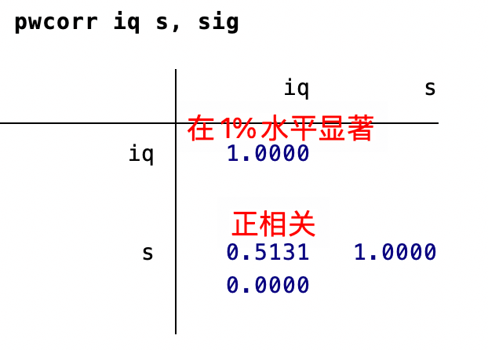
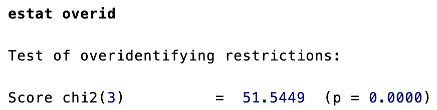
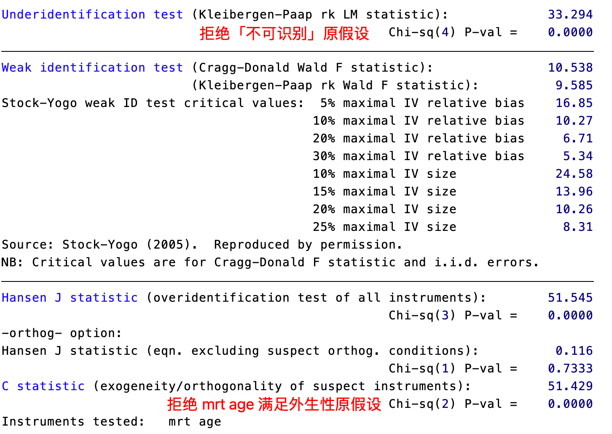
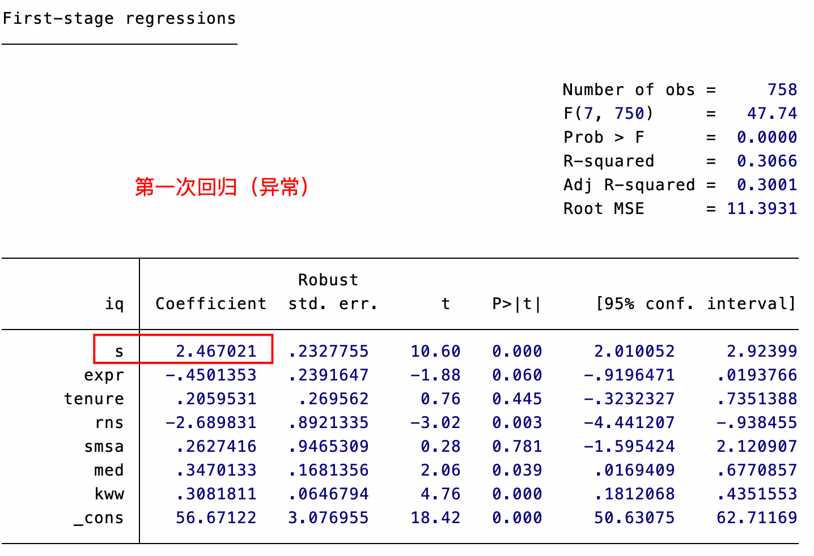
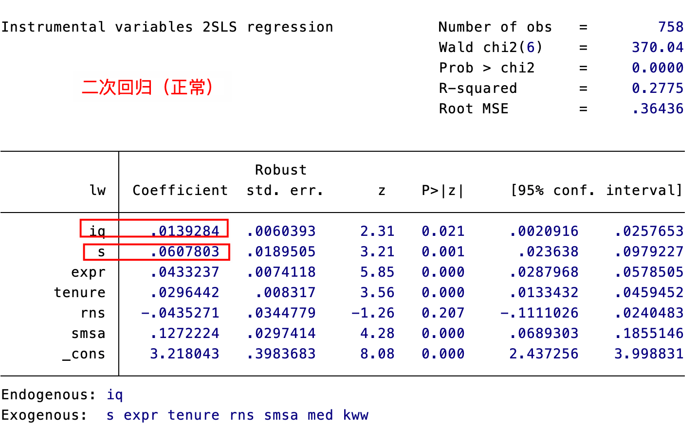
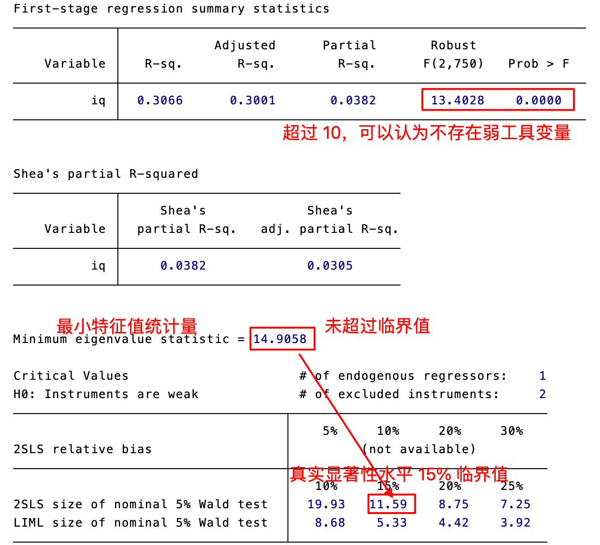
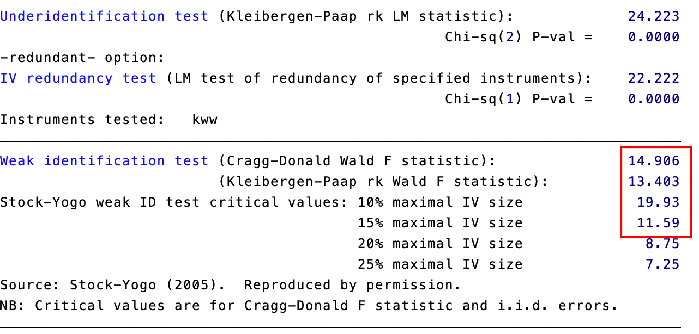
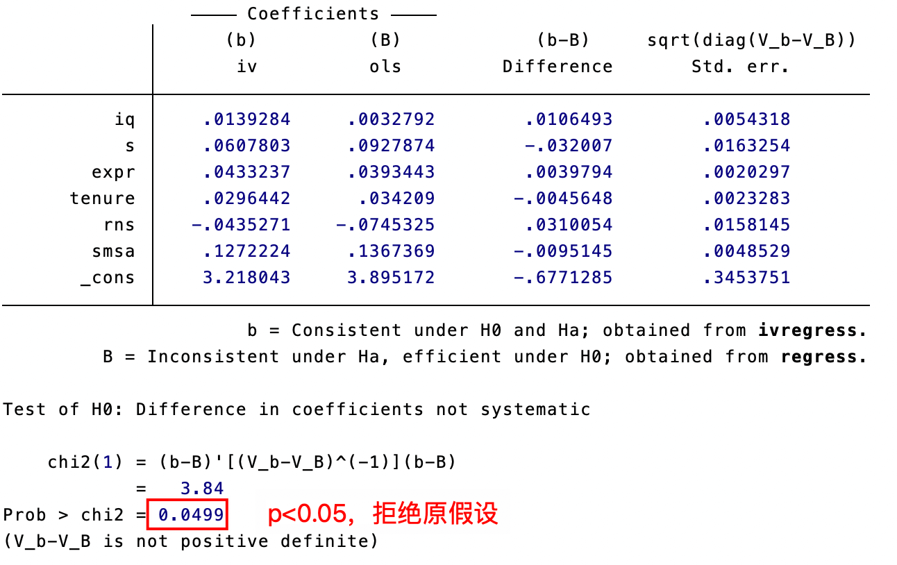
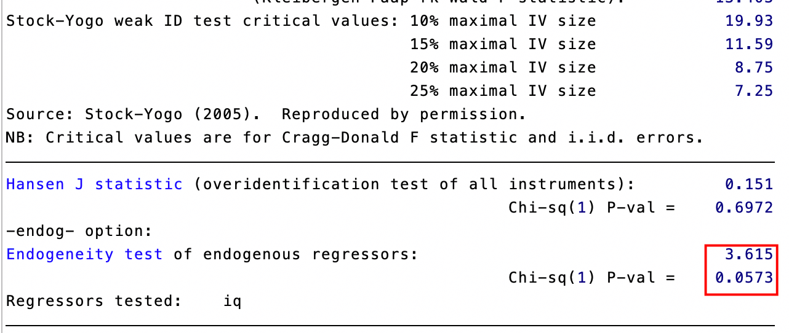

# 工具变量，2SLS 与 GMM

OLS能够成立的最重要条件是解释变量与扰动项不相关（即前定变量的假设）。否则，OLS估计量将是不一致的，即无论样本容量多大，OLS估计量也不会收敛到真实的总体参数。


## 工具变量法

内生性来源：

1. [[Chapter9#遗漏变量|遗漏变量偏差]]
2. 测量误差偏差：解释变量度量不准确
3. 联立方程偏差：由内生变量与误差项相关性导致的估计偏差，存在双向因果关系，两个方程的被解释变量和解释变量完全一样，两个方程可以联立，导致 OLS 不一样。

$$
\begin{cases}q_{t}^{d}=\alpha_{0} +\alpha_{1} p_{t}+u_{t}&\left( \text{Demand} \right)\\ q_{t}^{s}=\beta_{0} +\beta_{1} p_{t}+v_{t}&\left( \text{Supply} \right)\\ q_{t}^{d}=q_{t}^{s}&\end{cases}
$$

假设影响方程组中供给方程扰动项的因素可以分解为两部分，即可观测的气温$ x_{t}$ 与不可观测的其他因素：  

$$
q_{t}^{s}=\beta_{0}+\beta_{1}p_{t}+\beta_{2}x_{t}+v_{t}
$$
假定气温 $x_t$ 是个前定变量，与两个扰动项都不相关，即 $\operatorname{Cov}(x_{t}\,,u_{t})=0\,,\operatorname{Cov}\big(\,x_{t}\,,v_{t}\,\big)\,=0$ 。由于气温 $x_t$ 的变化使得供给函数 $q_{t}^{s}$ 沿着需求函数 $q_{t}^{\textit{d}}$ 移动，这使得我们可以估计出需求函数 $q_{t}^{d}$ 。

在这种情况下，称 $x_{t}$ 为“工具变量”（Instrumental Variable,简记IV）。

**一个有效的工具变量应满足以下条件**：

1. 相关性：工具变量与内生解释变量相关，即 $\mathrm{Cov}(\,x_t,p_{t}\,)\neq0$  
2. 外生性：工具变量与扰动项不相关，即 $\operatorname{Cov}(\,x_{t}\,,u_{t}\,)\,=0$  

如果工具变量与内生变量无关，则无法定义工具变量法。

如果工具变量与内生变量的相关性很弱,即 $\mathrm{Cov}\left(\,x_{t}\,,p_{t}\,\right)\approx0$ ，则会导致估计量 $\hat{\alpha}_{1,\mathrm{IV}}$ 的方差变得很大，这被称为“弱工具变量问题”。传统的工具变量法一般通过“二阶段最小二乘法”（TwoStageLeastSquare，简记2SLS或TSLS）来实现。

第一阶段回归：用内生解释变量对工具变量回归，即 $p_t\stackrel{\mathrm{OLS}}{\longrightarrow}x_t$ ，得到拟合值 $\hat{p}_{t}$ 

第二阶段回归：用被解释变量对第一阶段回归的拟合值进行回归,即 $q_{t}\xrightarrow{\mathrm{OLS}}\hat{p}_{t}$ 


## 工具变量作为一种矩估计

假设随机变量$x\sim N\left( \mu ,\sigma^{2} \right)$，其中$\mu ,\sigma^{2}$为待估计的参数。因为有两个待估参数，故需要使用以下两个总体矩条件：  

1. 一阶原点矩： ${\mathrm{E}}(\,x\,)\,=\mu$  
2. 二阶原点矩： $\operatorname{E}\left(\,x^{2}\,\right)\ =\operatorname{Var}(\,x\,)\ +\,{\left[\,\operatorname{E}\left(\,x\,\right)\,\right]}^{\,2}\,=\sigma^{2}\,+\mu^{2}$  

用对应的样本矩（sample moments）来替代总体矩条件可得以下联立方程组，求解后即得到对期 望与方差的矩估计。
$$
\begin{cases}\frac{1}{n}\sum_{i=1}^{n}x_{i} = \hat{\mu}\\[2ex]\frac{1}{n}\sum_{i=1}^{n}x_{i}^{2} = \hat{\mu}^{2} + \hat{\sigma}^{2}\end{cases}\quad\Rightarrow\quad\begin{cases}\hat{\mu} = \overline{x}\\[2ex]\hat{\sigma}^{2} = \frac{1}{n}\sum_{i=1}^{n} ( x_{i} - \overline{x} )^{2}\end{cases}
$$
阶条件：不在方程中出现的工具变量个数不能少于方程中内生解释变量的个数，称此条件为“阶条件”。  

根据是否满足阶条件可分为三种情况：  

（1）不可识别（unidentified）：工具变量个数小于内生解释变量个数；  
（2）恰好识别（justorexactly identified）：工具变量个数等于内生解释变量个数；  
（3）过度识别（overidentified）：工具变量个数大于内生解释变量个数。  


## 工具变量检验


### 不可识别检验

**作用**: 检验工具变量是否真正能够影响内生解释变量。

**特点**: 在扰动项服从不同假设的情况下，可以使用不同的统计量：

- 同方差扰动项：Anderson LM 统计量
- 异方差扰动项：Kleibergen-Paap rkLM 统计量

**应用条件**: 需要满足阶条件，即工具变量个数至少不小于内生解释变量个数。


### 弱工具变量检验

**作用**：检验工具变量与内生解释变量之间的相关性是否足够强。如果工具变量与内生解释变量之间的关系很弱，就会导致工具变量估计量 $\hat{\alpha}_{1,\mathrm{N}}$ 的方差变得很大，从而影响统计推断的可靠性。

**方法**:

- 偏 R²：衡量工具变量对内生解释变量的解释能力，但没有明确的阈值。
- F 统计量：检验第一阶段回归中工具变量系数是否显著，经验法则为 F 统计量大于 10。
最小特征值统计量：适用于多个内生解释变量的情况。
- Cragg-Donald Wald F 统计量：假设扰动项为同方差。
- Kleibergen-Paap Wald rkF 统计量：允许异方差扰动项。


### 过度识别检验

检验在过度识别情况下（工具变量个数大于内生解释变量个数），所有工具变量是否都满足外生性，即是否与扰动项不相关。

**特点**:

- 大前提：模型至少是恰好识别的，即有效工具变量至少与内生解释变量一样多。这个大前提无法检验，只能假定其成立。
- 原假设：所有工具变量都是外生的。
- 检验方法：将工具变量法的残差对所有外生变量回归，并检验工具变量系数是否显著。

**局限性**：即使接受原假设，也不能完全证明所有工具变量的外生性。

**适用情况**: 工具变量个数大于内生解释变量个数


### 豪斯曼检验

**作用**: 检验解释变量是否为内生变量，即是否需要使用工具变量法。


原假设：所有解释变量均为外生变量。

检验方法：比较 OLS 估计量与工具变量估计量之间的差异。

传统的豪斯曼检验假设在原假设成立的情况下 OLS 是最有效率的，不适用于存在异方差的情况。


### 杜宾-吴-豪斯曼检验 (DWH)

**作用:** 检验解释变量是否为内生变量。

原假设：所有解释变量均为外生变量。

检验方法：检验第一阶段回归的扰动项与原模型的扰动项是否相关。

在存在异方差的情况下也适用。

### 如何获得工具变量

寻找合适的工具变量通常比较困难，需要一定的创造性与想象力。寻找工具变量的步骤大致可以分为两步:
- 列出与内生解释变量 $(x)$ 相关的尽可能多的变量清单。
- 从这一清单中剔除与扰动项相关的变量。
第二步操作有一定难度，因为扰动项不可观测。 可以从候选变量与被解释变量的相关性着手判断候选变量 $(z)$ 是否与不可观测的扰动项 $\varepsilon$ 相关。


## 广义矩估计（GMM）

GMM 方法 在以下情况下比其他方法更有效：

- **扰动项存在异方差或自相关**: 在球形扰动项的假设下，二阶段最小二乘法 (2SLS) 是最有效率的估计方法。但如果扰动项存在异方差或自相关，则 GMM 方法比 2SLS 更有效。 GMM 方法可以通过选择最优权重矩阵来提高估计效率，并可以处理异方差和自相关问题。
- **过度识别**: 当工具变量的个数大于内生解释变量的个数时 (过度识别)，传统的矩估计方法无法使用。GMM 方法可以通过最小化目标函数来得到估计量，并可以进行过度识别检验，以检验所有工具变量是否均为外生。

## Stata 实例

使用 `grilic.dta`。

Mincer(1958)最早研究了工资与受教育年限的正相关关系，但遗漏了“能力”这个变量， 导致遗漏变量偏差。针对美国面板调查数据中的年轻男子组群(Young Men‘s Cohort of the National Longitudinal Survey，简记NLS-Y)，Griliches(1976)采用工具变量法对遗漏变量问题进行了校正。

```stata
pwcorr iq s, sig
```


计算 iq 和 s 的相关系数

`pwcorr` 是 Stata 中计算成对相关系数(pairwise correlation)的命令，与 `corr` 命令相比，`pwcorr` 在处理缺失值时更灵活，它会利用所有可用的观测值对进行计算，而不是删除含有任何缺失值的观测。
`sig`（可选）会在输出结果中显示相关系数的显著性水平(p值)，显著性水平表示相关系数不为零的统计显著性检验结果。

```stata
reg lw s expr tenure rns smsa, robust // 普通 OLS
reg lw s iq expr tenure rns smsa, robust
```

引入智商（iq）作为「能力」的[[Chapter9#^4b2d16|代理变量]]

由于用 iq 用来度量能力存在测量误差偏差，故 iq 是内生变量，考虑用变量 `(med, kww, mrt, age)` 作为 iq 的工具变量进行 2SLS 回归。

```stata
ivregress 2sls lw s expr tenure rns smsa (iq=med kww mrt age), robust
```

### 检验外生性

在此2SLS回归中，教育回报率反而上升到 13.73%，而智商(iq)对工资的贡献居然为负，似乎并不可信。使用工具变量法的前提是工具变量的有效性。为此，进行[[Chapter10#过度识别检验]]，考察是否所有工具变量均外生，即与扰动项不相关。

```stata
estat overid
```


结果强烈拒绝「所有工具变量均外生」的原假设（p 值过小），即认为某些（或某个） 工具变量不合格，与扰动项相关。我们怀疑`(mrt，age)`不满足外生性，故使用C统计量检验这两个工具变量的外生性。由于`ivregress`不提供C统计量，故下载非官方命令 `ivreg2`。

```stata
ssc install ivreg2 // 安装外部命令
ivreg2 lw s expr tenure rns smsa (iq=med kww mrt age), robust orthog(mrt age)
```

- 命令`ivreg2`的默认估计量为2SLS（如果加上选择项`gmm2 s robust`，则为两步最优 GMM 估计量
- 选择项`orthog(mrt age)`表示检验 (mrt，age)是否满足外生性。


考虑使用变量 `(med, kww)` 作为 iq 的工具变量，再次进行 2SLS 回归，同时显示第一阶段的回归结果：
```stata
ivregress 2sls lw s expr tenure rns smsa (iq=med kww), robust first
```




使用 `estat overid` 结果为强烈接受，判断 med 和 kww 是外生，与扰动项不相关。

### 检验相关性

```stata
estat firststage, all forcenonrobust
```

`estat firststage`：这是在进行工具变量回归后使用的诊断命令，用于检验工具变量的相关性和有效性，必须在 `ivregress` 命令之后使用

`all`：显示所有内生解释变量的第一阶段统计量，包括 F 统计量、R-squared、adjusted R-squared 等，对每个内生变量都会显示单独的诊断结果

`forcenonrobust`：强制使用非稳健标准误计算统计量，即使原始回归使用了稳健标准误，也会改用普通标准误



结论可以为：==不存在弱工具变量==

再使用有限信息最大似然法（LIML）
```stata
ivregress liml lw s expr tenure rns smsa (iq=med kww), robust
```

与之前使用 `ivregress 2sls` 的结果接近。

使用 `ivreg2` 对工具变量 kww 进行冗余检验：
```stata
ivreg2 lw s expr tenure rns rmsa (iq=med kww), robust redundant(kww)
```


### 检验是否存在内生解释变量（豪斯曼检验）

豪斯曼检验的原假设$H_o$：所有解释变量均为外生。

```stata
quietly reg lw iq s expr tenure rns smsa // 先做一次回归
estimates store ols // estimate store 是存储结果的命令，ols 是存储对象的名字（自己定的）
quietly ivregress 2sls lw s expr tenure rns smsa (iq=med kww)
estimates store iv
hausman iv ols, constant sigmamore
```

- 执行 Hausman 检验，比较 OLS 和 IV 估计结果
- `constant` ：包含常数项在检验中
- `sigmamore` ：使用更有效的方差估计



传统豪斯曼检验在[[Chapter7|异方差]]情况下不成立，因此使用异方差稳健 DWH 检验

```stata
estat endogenous
```
 
 结果 p 也小于 5%。

使用 `ivreg2`

```stata
ivreg2 lw s expr tenure rns smsa (iq=med, kww), robust endog(iq)
```



### 使用 GMM

存在异方差的情况下，GMM 比 2SLS 更有效率。

```stata
ivregress gmm lw s expr tenure rns smsa (iq=med kww) // 回归后查看与 2sls 结果的差别
estat overid
```

得到 p 值 0.7，认为所有工具变量均为外生，使用迭代 GMM
```stata
ivregress gmm lw s expr tenure rns smsa (iq=med kww), igmm
```

### 数据汇总与导出

如果希望将以上各种估计法的系数估计值及其标准误列在同一张表中，可使用以下命令： 

```stata
qui reg lw s expr tenure rns smsa, r 
est sto ols_no_iq
qui reg lw iq s expr tenure rns smsa,r 
est sto ols_with_iq
qui ivregress 2sls lw s expr tenure rns smsa (iq=med kww),r 
est sto tsls
qui ivregress liml lw s expr tenure rns smsa (iq=med kww),r 
est sto liml
qui ivregress gmm lw s expr tenure rns smsa (iq=med kww)
est sto gmm
qui ivregress gmm lw s expr tenure rns smsa (iq =med kww),igmm 
est sto igmm
estimates table ols_no_iq ols_with_iq tsls liml gmm igmm,b se // b 表示回归系数，se 表示显示标准误差
```

如果希望用一颗星表示10%的显著性水平，两颗星表示5%的显著性水平，三颗星表示1% 的显著性水平，则可以使用以下命令，

```stata
estimates table ols_no_iq ols_with_iq tsls liml gmm igmm, star(0.1 0.05 0.01)
```

如果要将上表输出到一个Microsoft Word文档，并以文件名iv来命名此文档，则可运行如下命令：

```stata
esttab ols_no_iq ols_with_iq tsls liml gmm igmm using iv.rtf, se r2 mtitle star(*0.1**0.05***0.01)
```


点击输出结果中的`iv.rtf`链接，即可打开此文件。
