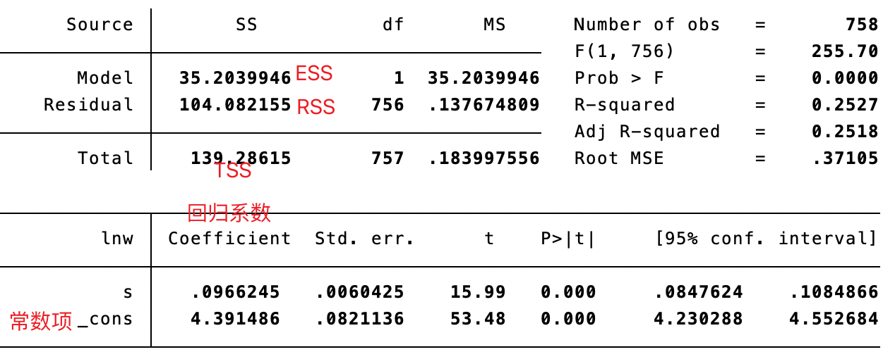

# 一元线性回归

## 关键概念

$ y_{i}=\alpha +\beta x_{i}+\epsilon_{i} $


- 残差（residual）：$e_{i} \equiv y_{i}-\hat{\alpha} -\hat{\beta} x_{i}$
- 平方和分解公式 TSS = ESS + RSS：$\sum_{i=1}^{n} \left( y_{i}-\bar{y} \right)^{2} =\sum_{i=1}^{n} \left( y_{i}-\hat{y} \right)^{2} +\sum_{i=1}^{n} e_{i}^{2}$ 
- 拟合优度：$R^{2}=\frac{\text{ESS}}{\text{TSS}} =1-\frac{\text{RSS}}{\text{TSS}}$


## Stata 代码解析


```stata
list s lnw in 1/10
```

`list`： 列出指定变量的值

`s` 和 `lnw`：选定的变量

`in 1/10`：只显示数据集中的第 1 行到第 10 行的数据

```stata
twoway scatter lnw s || lfit lnw s
```

`twoway`：告诉 stata 开始绘图

`scatter lnw s`：绘制 lnw 和 s 两个变量的散点图

`||`：散点图上加一个图层

`lfit lnw s`：拟合 lnw 和 s 之间的线性回归直线

> [!Note]
> 在 Stata 中，`lfit` 命令通常需要与 `scatter` 命令一起使用，因为 `lfit` 命令是在散点图的基础上进行回归线的拟合。在单独使用 `lfit` 命令时，Stata 会提示错误，因为没有提供需要拟合的数据点。因此，为了正确地使用 `lfit` 命令，通常需要先通过 `scatter` 命令绘制散点图，然后在此基础上使用 `lfit` 命令来拟合回归线。这种做法能够更清晰地展示数据的分布情况和回归线的拟合效果。

```stata
reg y x, noc
```

$y_{i}=\alpha +\beta x_{i}+\epsilon_{$i$}$

一元线性回归，y 是解释变量，x 是被解释变量

`noc` 参数可选，表示无常数项：$y_{i}=\beta x_{i}+\epsilon_{i}$

> [!何时可能用到无常数项回归？]
>
> 例如比较个人所得税对收入的依赖性，收入为 0，个人所得税自然也为 0。



```stata
sum s // 单变量特征值
return list // 针对上一条命令生成数据列表

// e 类命令：估计命令
reg lnw s // 执行了一个估计命令 reg
ereturn list // 针对上一条命令生成数据列表，需要用 ereturn
```

