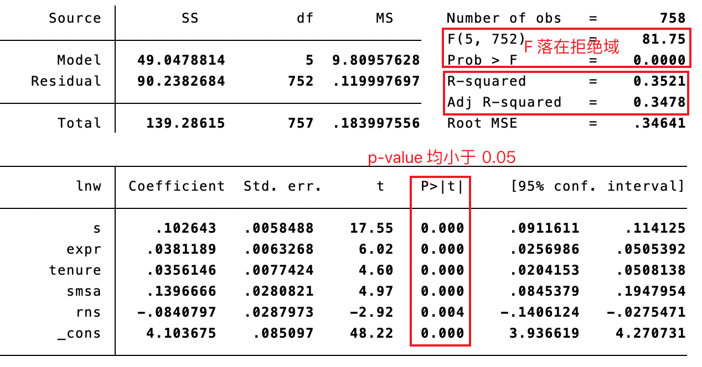
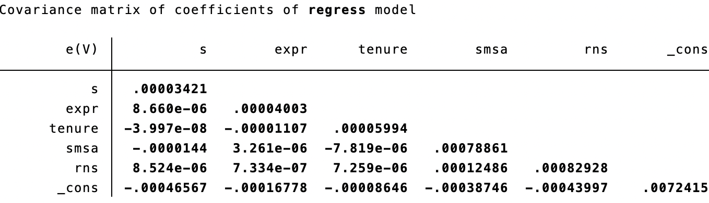

# 小样本 OLS


## 二元线性回归

$y_{i}=\alpha +\beta x_{i1}+\gamma x_{i2}+\epsilon_{i}$

```stata
reg y x1 x2

predict lny1 // 计算拟合值，命名为 lny1
predict e, re // 计算残差，命名为 e，re 可选参数指计算残差，没有则为计算拟合值

list lny lny1 e // 列出真实值和上面算出来的拟合值
```


### 古典线性回归模型的假定


- 线性假定：每个解释变量对$y_{i}$的边际效应为常数。如果边际效应可变（解释变量对因变量的影响可能不是恒定的，而是随变量值的变化而变化），可加入平方项（$x_{i2}^{2}$）或交叉项（$x_{i2}x_{i3}$）。
- 严格外生性（零条件均值）：误差项（残差）与所有的解释变量（自变量）在任何时刻都是不相关的。
- 不存在严格多重共线性：不存在某个解释变量是另一个解释变量的倍数，或可由其他解释变量线性表出的情形。


### 高斯-马尔可夫定理

扰动项理想情况下必须满足四个条件，这些条件被称为**高斯-马尔可夫条件（Gauss-Markov Conditions）**：

1. **零条件均值** $E(\epsilon_{i}|X_i)=0$
2. **同方差性** $E(\epsilon|X_i)= \sigma^2$ 对于所有 $i$均成立
3. **非自相关性** $\text{Cov}(\epsilon_i, \epsilon_j)=0, \quad i\neq j$
4. **自变量非随机性** $\text{Cov}(X_i, u_i)=0$

如果所有高斯-马尔可夫条件都满足，OLS是所有估计量中最优的，因为在数学上它被证明是**最佳线性无偏估计量**（Best Linear Unbiased Estimator, BLUE）。这个结论被称为**高斯-马尔可夫定理**。


## 假设检验


### 单系数 t 检验

检验某个特定自变量（或解释变量）对因变量是否具有显著的线性影响。

小样本理论（有限样本理论）：不要求样本容量$n\rightarrow \infty$

假定：$\epsilon \  |\  X\  \sim N\left( 0, \sigma^{2} I_{n} \right)$ （数据来自正态分布的总体）

> **正态分布的特点**
>
> 密度函数完全由均值和协方差矩阵决定
>
> 两个随机变量不相关就意味着相互独立
>
> 正态分布变量的线性函数仍然是正态分布

原假设$H_{0}:\  \beta_{k} =0$（假定自变量 ($X_k$) 对因变量 ($Y$) 没有线性影响）。检测在原假设成立的前提下，是否导致不太可能发生的小概率事件在一次抽样的样本中实现。如果小概率事件在一次抽样的样本被观测到，那么假设不可信，拒绝原假设，接受替代假设$H_{1}:\  \beta_{k} \neq 0$

#### 步骤

1. 计算 t 统计量：$t_{k}\equiv \frac{\hat{\beta}_{k}}{\text{SE} \left( \hat{\beta}_{k} \right)} \sim t\left( n \right)$，其中$\text{SE} \left( \hat{\beta}_{k} \right) =\frac{s}{\sqrt{n}}$
2. 计算显着性水平为$\alpha$的临界值$t_{\alpha /2}\left( n-K \right)$，通常$\alpha = 5\% , \alpha / 2 = 2.5\%$
3. 如果$|t_{k}|\geqslant t_{\alpha /2}\left( n-K \right)$，则 t 落入拒绝域，拒绝原假设。

计算 $\text{p-value} \equiv P\left( {}|T|>|t_{k}| \right) ,\  T\sim t\left( n-K \right)$

p值是一个概率值，表示在零假设为真的情况下，得到一个像 ( $t_k$ ) 或更极端的样本统计量（即偏离原假设的程度更大）的概率。

### F 检验

$$H_{0}:\  \beta_{2} =...=\beta_{k} =0$$

计算临界值 $F_{\alpha}\left( m,\  n-K \right)$，如果大于临界值，则落入拒绝域。


## Stata 实现

$$\ln w=\beta_{1} +\beta_{2} s+\beta_{3} \text{expr} +\beta_{4} \text{tenure} +\beta_{5} \text{smsa} +\beta_{6} \text{rns} +\epsilon$$

```stata
reg lnw s expr tenure smsa rns //... 先做线性回归
```



```stata
vce // variance convariance matrix estimated 协方差矩阵
```



```stata
reg lnw s expr tenure smsa if rns // 删掉 rns 为 0 的行进行回归
reg lnw s expr tenure smsa if !rns // 删掉 rns 不为 0 的行进行回归
reg lnw s expr tenure smsa if s>12 // 删掉 s 小于 12 的行进行回归

quietly reg lnw s expr tenure smsa rns // 不输出回归结果，以便后面使用 predict
```

进行假设检验，原假设为 s 对应的 $\beta_{2}=0.1$

```stata
test s=0.1
```

返回 F（1, 752）和 p-value

又检验 expr-tenure = 0

```stata
test expr = tenure
```

