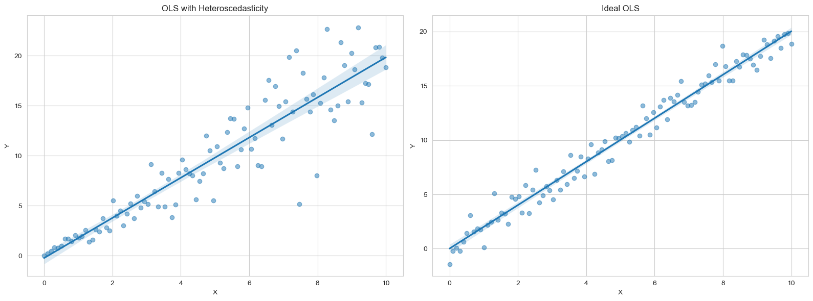

# 异方差

本章部分内容参考自：https://zhuanlan.zhihu.com/p/242140022

扰动项$\epsilon$的方差$\text{Var}(\epsilon_i|X)$不是常数，而是依赖于i。



## 异方差的后果

1. OLS 估计量依然无偏、一致且正态
2. t 检验、F 检验失效
3. 高斯-马尔可夫定理不再成立，OLS 不再是最佳线性无偏估计量。


## 异方差检验

> 到后面 Stata 代码实现就知道了解这些具体步骤没大必要。


### BP 检验

在回归模型$$y_i=\beta_1+\beta_2 x_{i 2}+\cdots+\beta_K x_{i K}+\varepsilon_i$$检验原假设$H_0: E(\epsilon_i^2|x_2,\cdots,x_K)=\sigma^2$

1. BP 检验假设此条件方差的函数为线性函数：$\varepsilon_i^2=\delta_1+\delta_2 x_{i 2}+\cdots+\delta_K x_{i K}+u_i$
2. 原假设$H_0: E(\epsilon_i^2|x_2,\cdots,x_K)=\sigma^2$简化为$H_0: \delta_2=\cdots=\delta_K=0$，即原假设为不存在异方差
3. 扰动项不可观测，于是使用残差平方向替代解释变量进行辅助回归。$e_{i}^{2}=\delta_{1}+\delta_{2}x_{i2}+\cdots+\delta_{K}x_{iK}+error_{i}$
4. 计算 K-1 下的 F 统计量：$\frac{R^2/( K-1 )}{( 1-R^2 )/( n-K )}\sim F( K-1 ,n-K )$，其中 $R^2$为辅助回归的拟合优度$R^2$。
5. 从而得到LM统计量：$LM=nR^2\xrightarrow{d}\chi^2(K-1)$
6. 根据卡方值确认是否落在拒绝域内


### 怀特检验

1. BP检验假设条件方差函数为线性函数，可能忽略高次项
2. 于是在BP检验的辅助回归中加入二次项（平方项和交叉项）

**优点**：理论上可以检验任何形式的异方差，因为根据泰勒展开式，二次函数可以很好地逼近任意光滑函数

**缺点**：如果解释变量多，则二次项将非常非常多，在辅助回归中将损失较多样本容量，自由度会降低


## 异方差处理

实操中一般不用GLS，而用OLS+稳健标准误。如果被解释变量取值为正，可以尝试通过**取对数**来缓解异方差的问题。


### 加权最小二乘法（WLS）

假定只存在异方差，不存在自相关，此时V是对角矩阵：

$\boldsymbol{V}=\begin{pmatrix}\omega_1&&&0\\&\omega_2&&\\&&\ddots&\\0&&&\omega_n\end{pmatrix}$

$\boldsymbol{C}=\begin{pmatrix}1/\sqrt{\omega_1}&&&0\\&1/\sqrt{\omega_2}&&\\&&\ddots&\\&0&&1/\sqrt{\omega_n}\end{pmatrix}$


代入 $\hat{\beta}_{GLS}$表达式：$(X^{\prime}V^{-1}X)^{-1}X^{\prime}V^{-1}y$


### 可行广义最小二乘法（FGLS）

使用 BP 检验的辅助回归：$e_{i}^{2}=\delta_{1}+\delta_{2}x_{i2}+\cdots+\delta_{K}x_{iK}+error_{i}$

得到$\sigma_i^2$的估计值，然后以 $1/\hat{\sigma_{i}}^{2}$ 为权重进行 WLS 估计。

实际操作时，为了保证$\hat{\sigma}_i^2$始终为正，可以假设辅助回归是指数函数的形式：
$$e_i^2=\sigma^2\exp(\delta_1+\delta_2x_{i2}+\cdots+\delta_Kx_{iK})v_i$$

取对数后做回归，可得$\ln e_i^2$的预测值，记为$\ln\hat{\sigma}_i^2$,以$1/\hat{\sigma}_i^2$为权重对原方程进行WLS估计，这个
估计量就是$\hat{\beta}_{FWLS}$


## Stata 实现


### 残差图

```stata
reg lntc lnq lnpl lnpk lnpf // 先得到回归结果
rvfplot // 绘图
rvfplot lnq // 绘制残差和解释变量的散点图
```


### 异方差检验

怀特检验

```stata
estat imtest, white
```

estat 指估计后统计量（post-estimated statistics），imtest 指 information matrix test。假设所有检验依赖前置 reg 命令。

BP 检验

```stata
estat hettest, iid // 使用默认拟合值 y
estat hettest, rhs iid // 使用 rhs 的解释变量
```

- estat hettest 是异方差检验的命令
- iid （可选）是指假定独立同分布，不同于前面介绍的$\varepsilon_i$服从正态分布，实践中常用


### WLS

先计算残差平方

```stata
quietly reg lntc lnq lnpl lnpk lnpf
predict e1, res // 计算残差并存储到变量 e1，详见第五章
g e2 = e1^2 //g 是 generate 的缩写，这是 Stata 中用来创建新变量的命令。
g lne2 = log(e2)
```

进行辅助回归

```stata
reg lne2 lnq, noc
predict lne2f
g e2f = exp(lne2f)
```

最后进行 WLS 回归

```stata
reg lntc lnq lnpl lnpk lnpf [aw=1/e2f]
```

在普通 OLS 里面加入权重，其中权重为 `1/e2f`。