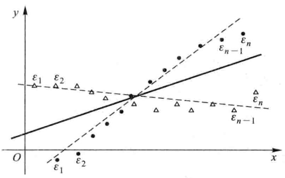
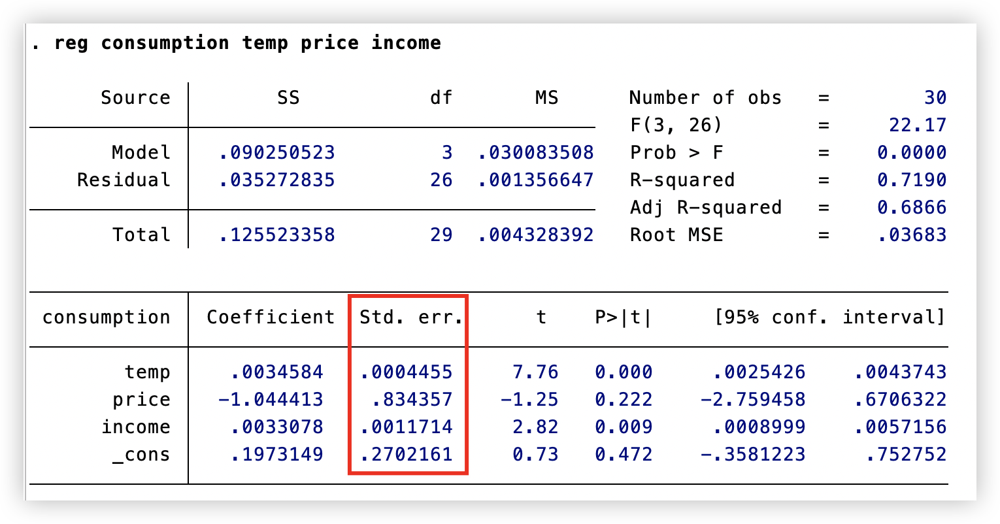
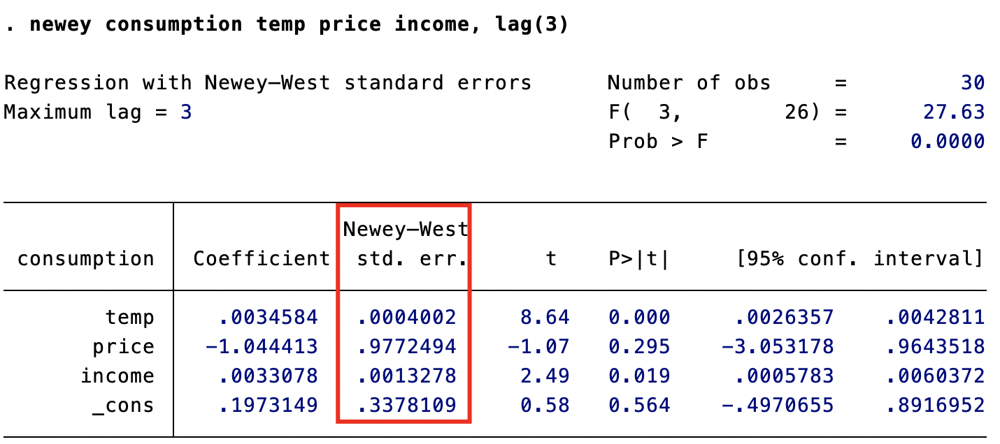
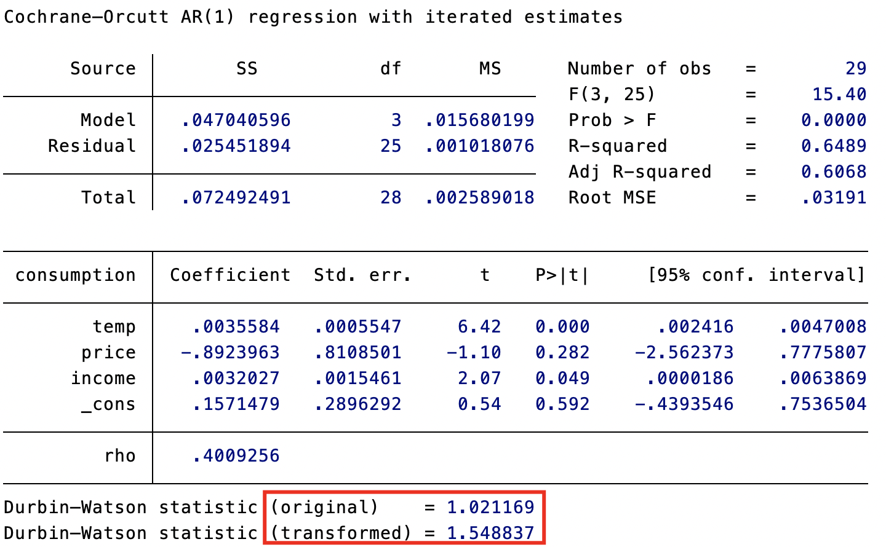
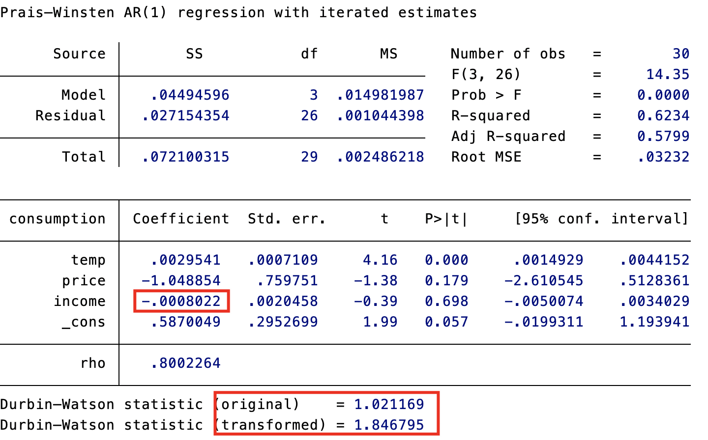

# 自相关

**自相关**，也称为序列相关，是指回归模型中误差项之间存在相关性。换句话说，一个观测值的误差项会影响到其他观测值的误差项。



##  自相关的后果

当存在自相关时：

- OLS 估计量仍然是无偏和一致的。
- OLS 估计量仍然服从渐近正态分布。
- OLS 估计量的方差表达式不再是 $\sigma^{2}$ $(X^{\prime}X)^{\mathrm{ ~~-~~ }1}$，因为 $\operatorname{Var}(,\varepsilon\mid X)\neq\sigma^{2}I,$ 因此，通常的 $t$ 检验 $,F$ 检验也失效了。
- 高斯－马尔可夫定理不再成立，即 OLS 不再是最佳线性无偏估计量（BLUE）。这是因为 OLS 估计忽略了误差项自相关所包含的信息。


## 可能导致自相关的原因

- **时间序列数据中的自相关**: 经济活动的连续性和持久性，意外事件或新政策的效应，滞后的调整过程等。
- **截面数据中的自相关**: 相邻观测单位之间的“溢出效应”，也称为“空间自相关”。
- **对数据的人为处理**: 数据中包含移动平均数、内插值或季节调整等。
- **设定误差**: 模型设定中遗漏了某个自相关的解释变量。


## 自相关的检验

常用的自相关检验方法包括：

- **画图**: 将残差与其滞后残差绘制成散点图或自相关图，可以直观地观察自相关是否存在。
- **Breusch-Godfrey (BG) 检验**: 这是一个较为通用的检验方法，可以检验高阶自相关。
- **Box-Pierce Q 检验和 Ljung-Box Q 检验**: 这两种检验方法基于残差的样本自相关系数，在大样本下等价，但 Ljung-Box Q 检验的小样本性质更好。
- **Durbin-Watson (DW) 检验**: 这是一种较早出现的检验方法，只能检验一阶自相关，且有较多限制，现已不常用。


##  自相关的处理

使用“OLS + 异方差自相关稳健的标准误”: 仍然使用 OLS 估计回归系数，但使用“异方差自相关稳健的标准误”（HAC），即在存在异方差与自相关的情况下也成立的稳健标准误。

使用“OLS + 聚类稳健的标准误：如果样本观测值可以分为不同的“聚类”，且同一聚类内的观测值自相关，不同聚类之间不相关，则可以使用“聚类稳健的标准误”。

使用可行广义最小二乘法（FGLS）: 通过估计误差项的协方差矩阵并对原模型进行变换，可以消除自相关，使得 OLS 估计量重新满足高斯－马尔可夫定理。常用的 FGLS 方法包括 Prais-Winsten 估计法和 Cochrane-Orcutt 估计法。

- FGLS 比 OLS 更有效率的前提是对自相关系数的估计比较准确，且满足严格外生性的假定。
- 如果不满足严格外生性，而仅仅满足前定解释变量的假定，则 FGLS 可能是不一致的，尽管 OLS 依然一致。

修改模型设定：自相关可能是由于模型设定错误导致的，例如遗漏了自相关的解释变量或将动态模型误设为静态模型。


### 如何选择自相关处理方法

- 如果只是需要得到一致的估计量，而对效率要求不高，则可以使用 OLS 加 HAC 标准误或聚类稳健标准误。
- 如果需要得到更有效的估计量，且满足 FGLS 的使用条件，则可以使用 FGLS。
- 最根本的解决方法是修改模型设定，消除自相关的根源。


## Stata 代码


### 自相关检验

```stata
tsset time
```

设定 time 变量为时间序列算子

```stata
graph twoway connect consumption temp100 time, msymbol(circle) msymbol(triangle)
```

`graph twoway`

`connect` 折线图

`consumption temp100 time` 绘制按时间序列排列的 consumption 和 temp100

`msymbol(circle) msymbol(triangle)` consumption 用圆圈，temp100 用三角形

```stata
reg consumption temp price income
predict e1, res
g e2 = L.e1 // L.e1 表示对 e1 取滞后项（lag）

twoway (scatter e1 e2)(lfit e1 e2) // 画出 e1 e2 的拟合回归线
ac e1
pac e1
```



e1 存在一阶自相关，下面进行检验：

```stata
estat bgodfrey
```

进行 BG 检验，原假设为“无自相关”，p<5% 即为拒绝原假设，存在自相关

```stata
wntestq e1
```

进行 Q 检验，原假设为“无自相关”，p<5% 即为拒绝原假设，存在自相关

```stata
estat dwatson
```

进行 DW 检验

> d=2，无一阶自相关
>
> d=0，一阶正自相关
>
> d=4，一阶负自相关


### 使用「OLS+HAC 标准误」处理自相关

```stata
newey consumption temp price income, lag(3)
```

计算 Newey-West 标准误，由于样本数量 n=30，因此取滞后阶数 $p=n^{1/4}\approx3$



发现与用 `reg`命令进行回归的标准误相差不大，滞后阶数翻倍为 6 再次尝试。


说明无论截断参数是 3 还是 6，Newey-West 标准误变化不大，比较稳健。


### 使用可行广义最小二乘法（FGLS）

```stata
prais consumption temp price income, corc
```

`prais` ：进行 Prais-Winsten 回归

- Prais-Winsten 回归是一种广义最小二乘法（GLS）估计方法
- 主要用于处理一阶自相关 AR(1) 问题
- 是 Cochrane-Orcutt 方法的改进版本

`corc` （可选）：

- 表示使用 Cochrane-Orcutt 迭代方法
- 这是一种迭代算法，用于估计自相关系数 ρ
- 如果不加 corc，则默认使用 Prais-Winsten 变换处理第一个观测值

把得到的参数估计值与 reg 命令相比较查看差别，查看 DW 统计量发现 DW 值提升了。



去除可选参数 croc ，进行 PW 估计。



虽然 DW 统计量提升较大，但收入效应的参数变为负，与预期不符合，PW 方法不如 OLS 稳健。


### 模型设定不正确

加入 temp 的一阶滞后值，进行 OLS 回归

```stata
reg consumpiton temp L.temp price income
```

