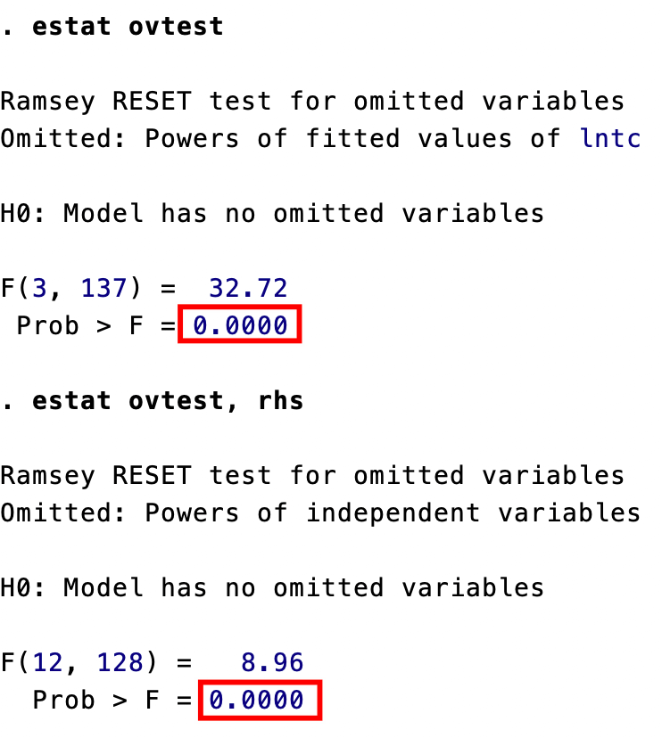

# 模型设定与数据问题


## 遗漏变量


真实模型：$y_{i}=x_{i1}^{\prime}\beta_{1}+x_{i2}^{\prime}\beta_{2}+\varepsilon_{i}$

实际估计模型：$y_{i}=x_{i1}^{\prime}\beta_{1}+u_{i}$

对比得到：遗漏的变量 $x_{i2}^{\prime}\beta_{2}$ 被归入到新扰动项 $u_i=x_{i2}^{\prime}\beta_{2}+\varepsilon_i$

A. 遗漏变量 $x_{i2}$ 与 $x_{i1}$ ==不相关==。OLS 仍然可以一致地估计 $\beta_1$，但扰动项方差可能因此增加，从而影响 OLS 的精确度。

B. 遗漏变量 $x_{i2}$ 与 $x_{i1}$ ==相关==。OLS 不再是一致估计，其偏差被称为「遗漏变量偏差」。


### 解决方法

1. 加入尽可能多的控制变量。把遗漏的变量补充上去。
2. 代理变量法。使用另一个相近变量代替不可得的解释变量。一个理想的代理变量应满足以下两个条件：（i）多余性（redundancy）：即**代理变量仅通过影响遗漏变量而作用于被解释变量**。 “智商”仅通过对“能力”的作用来影响工资收入。换言之，假如有“能力”的数据，那么再引入 “智商”作为解释变量就是多余的。（ii）剩余独立性：遗漏变量中不受代理变量影响的剩余部分与所有解释变量均不相关。 ^4b2d16
3. 工具变量法（10 章）
4. 使用面板数据（15-17 章）
5. 随机实验和自然实验（18 章）


## 无关变量

真实模型：$y_{i}=x_{i1}^{\prime}\beta_{1}+\varepsilon_{i}$

实际估计模型：$y_{i}=x_{i1}^{\prime}\beta_{1} +x_{i2}^{\prime}\beta_{2} + ( \varepsilon_{i} -x_{i2}^{\prime}\beta_{2} )$

加入了与被解释变量无关的解释变量 $x_{i2}^{\prime}$，OLS 仍然是一致的。


## 解释变量个数的选择

1. **校正可决系数** $\overline{R}^2$： 选择解释变量的个数 K 以最大化 $\overline{R}^2$。

2. **赤池信息准则**（Akaike Information Criterion，AIC）： 选择解释变量的个数 K，使得以下目标函数最小化： $$ \min_{K} \mathrm{AIC}\equiv\ln\left( e'e/n \right) +\frac{2}{n}K $$

   其中，右边**第一项为对模型拟合度的奖励**（减少残差平方和），而**第二项为对解释变量过多的惩罚**（解释变量个数 K 的增函数)1。当 K 上升时，第一项下降而第二项上升。

3. **贝叶斯信息准则**（Bayesian Information Criterion，BIC）或**施瓦茨信息准则**（Schwarz Information Criterion，SIC 或 SBIC）： 选择解释变量的个数 K，使得以下目标函数最小化： $$ \operatorname*{min}_{K} BIC \equiv ln(e'e/n) + \frac{ln n}{n}K $$ 

   BIC 准则与 AIC 准则只有第二项有差别。一般来说，ln n > 2（除非样本容量很小），故 **BIC 准则对于解释变量过多的惩罚比 AIC 准则更为严厉**。也就是说，**BIC 准则更强调模型的简洁性**。

4. **汉南 - 昆信息准则**（Hannan-Quinn Information Criterion, 简记 HQIC）：选择解释变量的个数 K，使得以下目标函数最小化： $$ \operatorname*{min}_{K} HQIC \equiv ln(e'e/n) + \frac{ln[ln(n)]}{n}K $$ 

在实践中，**比较常用 AIC 与 BIC，不常用 HQIC**。而且，虽然在大样本中 BIC 是一致估计，而 AIC 不是一致估计，但现实样本通常是有限的，而 **BIC 准则可能导致模型过小**（对解释变量过多的惩罚太严厉），故 **AIC 准则依然很常用**。

在时间序列模型中，常用信息准则来确定滞后阶数，比如确定自回归模型的阶数。 可以证明，根据 BIC 或 HQIC 计算的滞后阶数是真实参数的一致估计量。然而，根据 AIC 计算的滞后阶数却不是一致估计量，即使在大样本中也可能高估真实值。


### Stata 代码

```stata
quietly reg consumption temp price income // 先回归
estat ic // 计算信息准则
```


## 对函数形式的检验

很多经济关系是非线性的。因此，多元线性回归只能被看做是非线性经济关系的一阶线性近似。常用 Ramsey's RESET 检验，其基本思想是，如果怀疑非线性项被遗漏了，那么就把非线性项引人方程，并检验其系数是否显著。  

另一模型设定检验为「连接检验」。此处的“连接”指的是，将解释变量与被解释变量连接在一起的函数形式是否正确。连接检验的步骤如下：

1. 首先进行如下回归：$y=\delta_{0}+\delta_{1}\hat{y}+\delta_{2}\hat{y}^{2}+error$

2. 然后检验$H_{0}\colon\delta_{2}=0$ ，即拟合值平方 $\hat{y}^{2}$ 的系数是否为 0。

   如果模型设定正确，则 $\hat{y}^{2}$ 不应对被解释变量还有解释力。如果拒绝 $H_{0}\colon\delta_{2}=0$ ，则认为模型设定有误，可考虑加人非线性项或改变回归的函数形式（比如，取对数）。  


### Stata 代码

```stata
quietly reg lntc lnq lnpl lnpk lnpf // 先回归
linktest // 进行连接检验
```


`_hatsq`指的是连接性检验的平方项，此时发现其参数并不为 0，故存在模型设定误差。

```stata
estat ovtest
estat ovtest, rhs
```

进行 RESET 检验。



p 极小，说明强烈拒绝「无遗漏变量」的原假设。


## 多重共线性

**多重共线性**是指多元线性回归模型中解释变量之间存在高度相关性的现象。

**严格多重共线性**： 指某个解释变量可以完全由其他解释变量线性表示。现实数据中很少出现这种情况。即使出现，Stata 也会自动识别并删除多余的解释变量。

**近似多重共线性**： 指解释变量之间存在高度相关性，但并非完全线性相关。

**多重共线性的主要后果**：难以区分各个解释变量对被解释变量的单独影响；导致 OLS 估计量的方差增大，使得对系数的估计变得不准确。

多重共线性的检验：

1. 将每个解释变量分别对其他解释变量进行回归，如果得到的可决系数（$R^2$）较高，则说明该解释变量与其他解释变量之间存在高度相关性，可能存在多重共线性问题。
2. 方差膨胀因子（VIF）：VIF 是衡量多重共线性严重程度的常用指标。VIF 越大，说明多重共线性问题越严重。通常认为，如果最大的 VIF 超过 10，则表明存在严重的多重共线性。$$\mathrm{VIF}_k\equiv\frac{1}{1-R_k^2}$$

stata 命令：回归后使用 `estat vif`


### 处理多重共线性的方法

处理多重共线性，可以考虑以下几种方法：

A. 如果只关心整个方程预测被解释变量的能力，而不关心具体的回归系数，则通常可以不必理会多重共线性。这是因为多重共线性主要影响对单个变量贡献的估计，但对所有变量整体效应的估计仍然较为准确。

B. 如果关心具体的回归系数，但多重共线性并不影响所关心变量的显著性，也可以不必理会。

C. 如果多重共线性影响到所关心变量的显著性，可以采取以下措施：
- 增大样本容量： 增加样本容量可以降低多重共线性的影响。
- 剔除导致严重共线性的变量： 剔除与其他解释变量高度相关的变量，可以有效缓解多重共线性。
- 修改模型设定： 通过改变模型的函数形式、引入新的解释变量或使用其他估计方法等方式，可以尝试解决多重共线性问题。


## 极端数据

样本数据中少数离大多数观测值很远的值被称为极端观测值。

可以证明，第i 个观测数据对回归系数的“影响力”或“杠杠作用”（leverage）可以通过投影矩阵$ P\equiv X ( X^{\prime}X)^{-1}X^{\prime} $的第 i 个主对角线元素来表示：

$\mathrm{lev}_i\equiv\mathbf{x}_i^{\prime} ( X^{\prime}X )^{-1}\mathbf{x}_i$

所有观测数据的影响力 $\mathrm{lev}_{i}$ 满足：$0\leqslant\mathrm{lev}_{i}\leqslant1 , ( i=1 ,\cdots,n ) ;\sum_{i=1}^{n} \mathrm{lev}_{i} = K$


### Stata 代码

```stata
reg y x1 x2 x3 // 先回归
predict lev, leverage // 列出所有解释变量的 lev 值
gsort - lev // 将所有观测值按照 lev 降序排列
sum lev // 看到 lev 的最大值和平均值
list lev in 1/3 // 列出从第一个到第三个数据的 lev
```


## 虚拟变量

如果使用“定性数据”（qualitative data）或“分类数据”（categorical data），通常需要引入“虚拟变量”，即取值为0或1的变量。比如，性别分男女，可定义男：D= 0，女：D= 1


### Stata 代码

```stata
gen d = (year>=1978)
```

新建一个虚拟变量，year 变量 >= 1978 设置为 1.

```stata
tabulate province, generate(pr)
```

假设 province 变量共有 30 个类型，为每个类型设置一个虚拟变量，变量前缀为`pr`，生成的是`pr1, pr2,...pr30`，变量顺序依照 province 的字母而定。回归时可以这么写：

```stata
reg y x1 x2 pr2 -pr30
```


## 经济结构变动的检验（Stata）

首先绘出时间趋势图，考虑一个简单的消费函数$c_t = \alpha + \beta y_t+\varepsilon_t$做回归，使用传统的邹检验（F检验）来检验消费函数是否在1992年发生结构变动。分别对整个样本、1992年之前及之后的子样本进行回归，以获得其残差平方和。

```stata
graph twoway connect c y year, msymbol(circle) msymbol(triangle)

reg c y

scalar ssr = e(rss)
```

`e()`表示调用上面回归产生的结果

> [! scalar 和 gen 命令]
> scalar（标量）的特点：
>
> - 只存储单个数值
> - 独立于数据集存在
> - 在整个 Stata 会话中都可访问
> - 计算速度更快
> - 适合存储统计量、计算中间结果等单个值
> - 使用 `scalar list` 可以查看所有标量
>
> gen（generate）的特点：
>
> - 创建新的变量列
> - 与数据集绑定
> - 会为数据集中的每个观测值都创建一个值
> - 占用更多内存
> - 适合存储多个观测值的数据
> - 通过 `browse` 或 `list` 命令查看

```stata
reg c y if year<1992
scalar ssr1 = e(rss)

reg c y if year>=1992
scalar ssr2 = e(rss)
```

手搓 F 统计量：$F=\frac{SSR-SSR1-SSR2}{K} \div \frac{SSR1+SSR2}{n-2K}$得到 F 为 13.56


### 使用虚拟变量法

```stata
gen d = (year > 1991)
gen yd = y * d

reg c y d yd

test d yd // 检验d和yd联合显著性
```


### 使用[[Chapter5_Adv#^a30179|稳健标准误]]

```stata
reg c y d yd, robust
```

结论：无论是否存在异方差，都可以强烈拒绝「没有结构变动」的原假设。


## 缺失数据与线性插值

在现实数据中，有时会出现某些时期数据缺失（missingdata）的情形，尤其是历史比较久远的数据。缺失的观测值在Stata中以`.`来表示，在运行Stata命令时（比如`reg`），会自动将缺失观测值从样本中去掉，导致样本容量损失。在数据缺失不严重的情况下，为了保持样本容量，可采用“线性插值”（linear-interpolation）的方法来补上缺失数据。  

考虑最简单的情形。已知 $x_{t-1}$ 与 $x_{t+1}$ ，但缺失 $x_{t}$ 的数据，则 $x_{t}$ 对时间 $t$ 的线性插值为  

$$
\hat{x}_{t}=\frac{x_{t-1}+x_{t+1}}{2}
$$

更一般地，假设与 $x$ （通常为时间）对应的 $y$ 缺失，而最临近的两个点分别为 $\left(x_{0},y_{0}\right)$ 与 $(x_{1},y_1)$，且 $x_{0}<x<x_{1}$ ，则 $y$ 对 $x$ 的线性插值为  

$$
\hat{y}=\frac{y_{1}-y_{0}}{x_{1}-x_{0}}({\ x-x_{0}})\ +y_{0}
$$


### Stata 代码

```stata
ipolate y x, gen(newvar)
```

ipolate 指 interpolate，上面代码意思是将变量 y 对变量 x 进行线性插值，插入的值记为变量 newvar。

如果变量y有指数增长趋势，则应先取对数，再用 $\ln y$进行线性插值。

```stata
gen lny1 = log(y1)
ipolate lny1 year, gen(lny3)
gen y3=exp(lny3)
```


